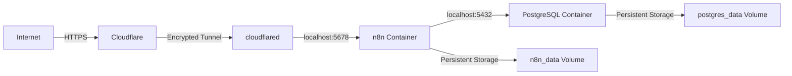
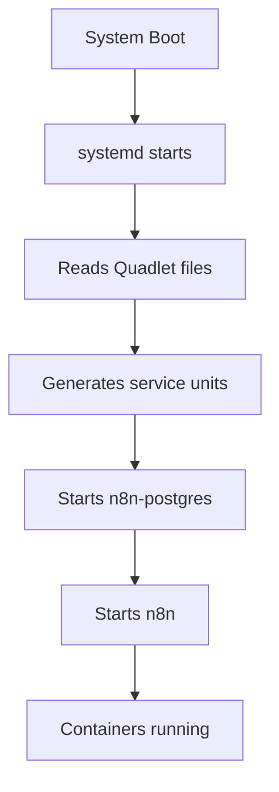
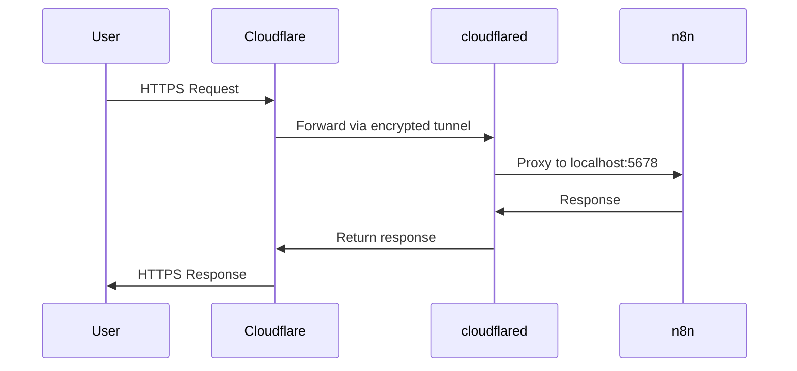
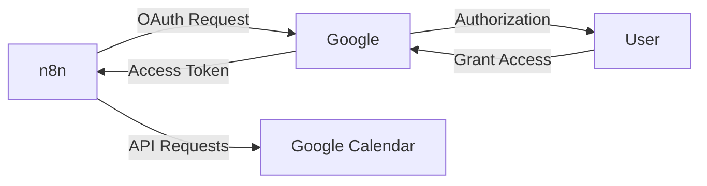

# Complete n8n Setup Guide with Podman and Cloudflare Tunnel

A comprehensive guide to setting up n8n workflow automation on Ubuntu using Podman containers, PostgreSQL database, and Cloudflare Tunnel for secure external access.

## Table of Contents

- [Overview](#overview)
- [Architecture](#architecture)
- [Prerequisites](#prerequisites)
- [Part 1: Install Podman](#part-1-install-podman)
- [Part 2: Set Up n8n with PostgreSQL](#part-2-set-up-n8n-with-postgresql)
- [Part 3: Configure Quadlets for Auto-Start](#part-3-configure-quadlets-for-auto-start)
- [Part 4: Set Up Cloudflare Tunnel](#part-4-set-up-cloudflare-tunnel)
- [Part 5: Configure Google OAuth](#part-5-configure-google-oauth)
- [Maintenance and Upgrades](#maintenance-and-upgrades)
- [Troubleshooting](#troubleshooting)

## Overview

This guide will help you set up a production-ready n8n instance with:

- **Podman containers** for containerization (rootless, daemonless alternative to Docker)
- **PostgreSQL database** for persistent data storage
- **Cloudflare Tunnel** for secure external access without port forwarding
- **Custom domain** with automatic HTTPS
- **Auto-start on boot** using systemd Quadlets
- **Google Calendar integration** with OAuth



## Architecture

The final setup consists of:

1. **Two Podman containers**:

   - PostgreSQL 15 (database)
   - n8n latest (workflow automation)

2. **Networking**:

   - Custom Podman network (`n8n-network`)
   - Cloudflare Tunnel for external access
   - No exposed ports to the internet

3. **Storage**:

   - Named volumes for data persistence
   - Survives container recreation and system reboots

4. **Service Management**:
   - Systemd Quadlets for container management
   - Automatic startup on system boot

## Prerequisites

- Ubuntu 25.04 (or similar Linux distribution)
- Root or sudo access
- A domain name managed by Cloudflare
- Basic command line knowledge

## Part 1: Install Podman

### Check System Architecture

```bash
uname -m
```

This will show `x86_64` (Intel/AMD) or `aarch64` (ARM64).

### Install Podman

For Ubuntu 20.10 and later (including 25.04):

```bash
sudo apt update
sudo apt install -y podman
```

For older Ubuntu versions, you'll need to add the Kubic repository. See [Podman installation documentation](https://podman.io/getting-started/installation).

### Verify Installation

```bash
podman --version
```

### Configure Rootless Mode

Enable rootless containers (allows running containers without root privileges):

```bash
# Check if subuid and subgid are configured
grep $USER /etc/subuid /etc/subgid

# If nothing shows, add them:
echo "$USER:100000:65536" | sudo tee -a /etc/subuid
echo "$USER:100000:65536" | sudo tee -a /etc/subgid
```

### Test Podman

```bash
podman run hello-world
```

## Part 2: Set Up n8n with PostgreSQL

### Create Network

Create a dedicated network for n8n and PostgreSQL to communicate:

```bash
podman network create n8n-network
```

### Start PostgreSQL Container

```bash
podman run -d \
  --name n8n-postgres \
  --network n8n-network \
  -e POSTGRES_USER=n8n \
  -e POSTGRES_PASSWORD=n8n \
  -e POSTGRES_DB=n8n \
  -v n8n_postgres_data:/var/lib/postgresql/data \
  docker.io/library/postgres:15
```

Wait a few seconds for PostgreSQL to initialize.

### Start n8n Container

```bash
podman run -d \
  --name n8n \
  --network n8n-network \
  -p 5678:5678 \
  -e DB_TYPE=postgresdb \
  -e DB_POSTGRESDB_HOST=n8n-postgres \
  -e DB_POSTGRESDB_PORT=5432 \
  -e DB_POSTGRESDB_DATABASE=n8n \
  -e DB_POSTGRESDB_USER=n8n \
  -e DB_POSTGRESDB_PASSWORD=n8n \
  -e N8N_HOST="yourdomain.com" \
  -e N8N_PORT="5678" \
  -e N8N_PROTOCOL="https" \
  -e WEBHOOK_URL="https://yourdomain.com/" \
  -e GENERIC_TIMEZONE="America/Los_Angeles" \
  -v n8n_data:/home/node/.n8n \
  docker.io/n8nio/n8n
```

**Note**: Replace `yourdomain.com` with your actual domain. We'll set this up properly in Part 4.

### Verify Containers are Running

```bash
podman ps
```

You should see both `n8n` and `n8n-postgres` containers running.

### Test n8n Locally

```bash
curl -I http://localhost:5678
```

You should receive a `200 OK` response.

## Part 3: Configure Quadlets for Auto-Start

Quadlets are the modern way to manage containers with systemd. They replace the older `podman generate systemd` approach.



### Create Quadlet Directory

```bash
mkdir -p ~/.config/containers/systemd
```

### Create Network Quadlet

```bash
nano ~/.config/containers/systemd/n8n-network.network
```

Add:

```ini
[Network]
NetworkName=n8n-network
```

### Create PostgreSQL Quadlet

```bash
nano ~/.config/containers/systemd/n8n-postgres.container
```

Add:

```ini
[Unit]
Description=n8n PostgreSQL Database
After=network-online.target

[Container]
Image=docker.io/library/postgres:15
ContainerName=n8n-postgres
Environment=POSTGRES_USER=n8n
Environment=POSTGRES_PASSWORD=n8n
Environment=POSTGRES_DB=n8n
Volume=n8n_postgres_data:/var/lib/postgresql/data
Network=n8n-network.network

[Service]
Restart=always
TimeoutStartSec=900

[Install]
WantedBy=default.target
```

### Create n8n Quadlet

```bash
nano ~/.config/containers/systemd/n8n.container
```

Add (update domain and timezone as needed):

```ini
[Unit]
Description=n8n Workflow Automation
After=n8n-postgres.service
Requires=n8n-postgres.service

[Container]
Image=docker.io/n8nio/n8n:latest
ContainerName=n8n
PublishPort=5678:5678
Environment=DB_TYPE=postgresdb
Environment=DB_POSTGRESDB_HOST=n8n-postgres
Environment=DB_POSTGRESDB_PORT=5432
Environment=DB_POSTGRESDB_DATABASE=n8n
Environment=DB_POSTGRESDB_USER=n8n
Environment=DB_POSTGRESDB_PASSWORD=n8n
Environment=N8N_HOST=yourdomain.com
Environment=N8N_PORT=5678
Environment=N8N_PROTOCOL=https
Environment=WEBHOOK_URL=https://yourdomain.com/
Environment=GENERIC_TIMEZONE=America/Los_Angeles
Volume=n8n_data:/home/node/.n8n
Network=n8n-network.network

[Service]
Restart=always
TimeoutStartSec=900

[Install]
WantedBy=default.target
```

### Stop Existing Containers

```bash
podman stop n8n n8n-postgres
podman rm n8n n8n-postgres
```

### Enable and Start Services

```bash
# Reload systemd to recognize Quadlets
systemctl --user daemon-reload

# Start services (Quadlets auto-enable them)
systemctl --user start n8n-postgres.service
systemctl --user start n8n.service

# Enable lingering (services start even when not logged in)
loginctl enable-linger $USER
```

### Verify Services

```bash
# Check status
systemctl --user status n8n-postgres.service
systemctl --user status n8n.service

# Check containers
podman ps
```

### Test Auto-Start

```bash
sudo reboot
```

After reboot, verify containers started automatically:

```bash
podman ps
systemctl --user status n8n.service
```

## Part 4: Set Up Cloudflare Tunnel

Cloudflare Tunnel provides secure access to your n8n instance without exposing ports or requiring port forwarding.



### Install cloudflared

For ARM64 systems (like Raspberry Pi):

```bash
# Download cloudflared
wget https://github.com/cloudflare/cloudflared/releases/latest/download/cloudflared-linux-arm64

# Make executable
chmod +x cloudflared-linux-arm64

# Move to system path
sudo mv cloudflared-linux-arm64 /usr/local/bin/cloudflared

# Verify installation
cloudflared --version
```

For x86_64 systems:

```bash
wget https://github.com/cloudflare/cloudflared/releases/latest/download/cloudflared-linux-amd64
chmod +x cloudflared-linux-amd64
sudo mv cloudflared-linux-amd64 /usr/local/bin/cloudflared
cloudflared --version
```

### Authenticate with Cloudflare

```bash
cloudflared tunnel login
```

This will open a browser window. Log in to Cloudflare and select your domain.

### Create a Tunnel

```bash
cloudflared tunnel create n8n-tunnel
```

Copy the **Tunnel ID** that's displayed (format: `xxxxxxxx-xxxx-xxxx-xxxx-xxxxxxxxxxxx`).

### Create Tunnel Configuration

```bash
sudo mkdir -p /etc/cloudflared
sudo nano /etc/cloudflared/config.yml
```

Add (replace `TUNNEL_ID` with your actual tunnel ID and `yourdomain.com` with your domain):

```yaml
tunnel: TUNNEL_ID
credentials-file: /home/yourusername/.cloudflared/TUNNEL_ID.json

ingress:
  - hostname: n8n.yourdomain.com
    service: http://localhost:5678
  - service: http_status:404
```

### Create DNS Record in Cloudflare

#### **Option A: Using CLI**

```bash
cloudflared tunnel route dns n8n-tunnel n8n.yourdomain.com
```

#### **Option B: Manually in Dashboard**

1. Log in to [Cloudflare Dashboard](https://dash.cloudflare.com)
2. Select your domain
3. Go to **DNS** → **Records**
4. Add a **CNAME** record:
   - **Type**: CNAME
   - **Name**: n8n (or your preferred subdomain)
   - **Target**: `TUNNEL_ID.cfargotunnel.com`
   - **Proxy status**: Proxied (orange cloud)
   - **TTL**: Auto
5. Click **Save**

### Test the Tunnel

```bash
cloudflared tunnel run n8n-tunnel
```

Open your browser and try accessing: `https://n8n.yourdomain.com`

If it works, press `Ctrl+C` to stop the test.

### Install as System Service

```bash
# Install the service
sudo cloudflared service install

# Start the service
sudo systemctl start cloudflared

# Enable auto-start on boot
sudo systemctl enable cloudflared

# Check status
sudo systemctl status cloudflared
```

### Update n8n Configuration

Edit the n8n Quadlet to use your domain:

```bash
nano ~/.config/containers/systemd/n8n.container
```

Update these environment variables:

```ini
Environment=N8N_HOST=n8n.yourdomain.com
Environment=N8N_PROTOCOL=https
Environment=WEBHOOK_URL=https://n8n.yourdomain.com/
```

Reload and restart:

```bash
systemctl --user daemon-reload
systemctl --user restart n8n.service
```

### Verify Everything Works

Visit `https://n8n.yourdomain.com` in your browser. You should see the n8n interface!

## Part 5: Configure Google OAuth

To use Google Calendar and other Google services in n8n, you need to set up OAuth credentials.



### Create Google Cloud Project

1. Go to [Google Cloud Console](https://console.cloud.google.com/)
2. Click **"Select a project"** → **"New Project"**
3. Enter project name (e.g., "n8n Integration")
4. Click **"Create"**

### Enable Google Calendar API

1. Make sure your project is selected
2. Go to **"APIs & Services"** → **"Library"**
3. Search for **"Google Calendar API"**
4. Click on it and click **"Enable"**

### Configure OAuth Consent Screen

1. Go to **"APIs & Services"** → **"OAuth consent screen"**
2. Choose **"External"** (unless you have Google Workspace)
3. Click **"Create"**

Fill in required fields:

- **App name**: n8n Integration
- **User support email**: Your email
- **Developer contact email**: Your email

4. Click **"Save and Continue"**

On the **Scopes** page: 5. Click **"Add or Remove Scopes"** 6. Search for and add:

- `.../auth/calendar` (full calendar access)

7. Click **"Update"** → **"Save and Continue"**

On the **Test users** page: 8. Click **"Add Users"** 9. Add your Google email address 10. Click **"Save and Continue"**

### Create OAuth Credentials

1. Go to **"APIs & Services"** → **"Credentials"**
2. Click **"Create Credentials"** → **"OAuth client ID"**
3. Application type: **"Web application"**
4. Name: **"n8n"**
5. Under **"Authorized redirect URIs"**, add:
   ```
   https://n8n.yourdomain.com/rest/oauth2-credential/callback
   ```
6. Click **"Create"**
7. **Copy and save**:
   - **Client ID**
   - **Client Secret**

### Add Credentials in n8n

1. Open n8n: `https://n8n.yourdomain.com`
2. Click your profile icon → **"Settings"**
3. Go to **"Credentials"**
4. Click **"Add Credential"**
5. Search for **"Google Calendar OAuth2 API"**
6. Fill in:
   - **Credential Name**: Google Calendar
   - **Client ID**: (paste from Google Cloud Console)
   - **Client Secret**: (paste from Google Cloud Console)
7. Click **"Connect my account"**
8. Authorize in the Google popup
9. You'll be redirected back to n8n with the credential connected

### Test the Credential

1. Create a new workflow
2. Add a **"Google Calendar"** node
3. Select your credential
4. Choose an operation (e.g., "Get All" calendars)
5. Click **"Execute Node"**

You should see your calendars listed!

## Maintenance and Upgrades

### Upgrading n8n

Check current version:

```bash
podman logs n8n | grep "Version:"
```

Upgrade to latest:

```bash
# Pull latest image
podman pull docker.io/n8nio/n8n:latest

# Restart service (uses new image)
systemctl --user restart n8n.service

# Verify new version
podman logs n8n | grep "Version:"
```

Your data persists in volumes, so upgrades are safe.

### Pin to Specific Version

Edit the Quadlet:

```bash
nano ~/.config/containers/systemd/n8n.container
```

Change:

```ini
Image=docker.io/n8nio/n8n:1.123.5
```

Then reload and restart:

```bash
systemctl --user daemon-reload
systemctl --user restart n8n.service
```

### Managing Services

**View status:**

```bash
systemctl --user status n8n.service
systemctl --user status n8n-postgres.service
sudo systemctl status cloudflared
```

**View logs:**

```bash
# n8n logs
podman logs -f n8n

# PostgreSQL logs
podman logs -f n8n-postgres

# Cloudflare tunnel logs
sudo journalctl -u cloudflared -f

# Systemd service logs
journalctl --user -u n8n.service -f
```

**Restart services:**

```bash
systemctl --user restart n8n.service
systemctl --user restart n8n-postgres.service
sudo systemctl restart cloudflared
```

**Stop services:**

```bash
systemctl --user stop n8n.service
systemctl --user stop n8n-postgres.service
sudo systemctl stop cloudflared
```

### Backup Data

Your data is stored in named volumes. To back up:

```bash
# List volumes
podman volume ls

# Inspect volume location
podman volume inspect n8n_data
podman volume inspect n8n_postgres_data

# Create backup
podman run --rm -v n8n_data:/data -v $(pwd):/backup \
  alpine tar czf /backup/n8n_backup_$(date +%Y%m%d).tar.gz /data

podman run --rm -v n8n_postgres_data:/data -v $(pwd):/backup \
  alpine tar czf /backup/postgres_backup_$(date +%Y%m%d).tar.gz /data
```

## Troubleshooting

### n8n Won't Start

```bash
# Check service status
systemctl --user status n8n.service

# Check logs
podman logs n8n

# Check if PostgreSQL is running
podman ps | grep postgres

# Restart PostgreSQL first, then n8n
systemctl --user restart n8n-postgres.service
systemctl --user restart n8n.service
```

### Cloudflare Tunnel Error 1033

This means the tunnel can't connect to n8n.

```bash
# Check tunnel status
sudo systemctl status cloudflared

# Check tunnel logs
sudo journalctl -u cloudflared -n 50

# Test n8n locally
curl -I http://localhost:5678

# Verify tunnel config
cat /etc/cloudflared/config.yml
```

Make sure:

- n8n container is running
- Service URL is `http://localhost:5678`
- Credentials file path is correct

### Chrome Shows "Connection Not Secure"

This usually means you're accessing via IP instead of domain. Always use your Cloudflare domain: `https://n8n.yourdomain.com`

### Google OAuth Error: "invalid_client"

Common causes:

- Wrong Client ID or Secret (copy carefully)
- Redirect URI mismatch in Google Cloud Console
- Extra spaces when pasting credentials
- Changes not yet propagated (wait 5 minutes)

### Container Won't Start After Reboot

```bash
# Check if lingering is enabled
loginctl show-user $USER | grep Linger

# Enable lingering
loginctl enable-linger $USER

# Manually start services
systemctl --user start n8n-postgres.service
systemctl --user start n8n.service
```

### Port Already in Use

```bash
# Check what's using port 5678
sudo ss -tlnp | grep 5678

# If Caddy or another service is using it, stop it
sudo systemctl stop caddy
```

### Reset Everything

If you need to start fresh:

```bash
# Stop all services
systemctl --user stop n8n.service
systemctl --user stop n8n-postgres.service
sudo systemctl stop cloudflared

# Remove containers
podman rm -f n8n n8n-postgres

# Remove volumes (WARNING: deletes all data!)
podman volume rm n8n_data n8n_postgres_data

# Remove network
podman network rm n8n-network

# Then follow setup from Part 2
```

## Useful Commands Reference

### Podman

```bash
# List running containers
podman ps

# List all containers
podman ps -a

# View logs
podman logs <container-name>
podman logs -f <container-name>  # follow

# Execute command in container
podman exec -it <container-name> bash

# Inspect container
podman inspect <container-name>

# List volumes
podman volume ls

# List networks
podman network ls

# Pull image
podman pull <image-name>

# Remove container
podman rm <container-name>

# Remove image
podman rmi <image-name>
```

### Systemd (user services)

```bash
# Status
systemctl --user status <service-name>

# Start
systemctl --user start <service-name>

# Stop
systemctl --user stop <service-name>

# Restart
systemctl --user restart <service-name>

# Enable (auto-start)
systemctl --user enable <service-name>

# Disable
systemctl --user disable <service-name>

# Reload configuration
systemctl --user daemon-reload

# View logs
journalctl --user -u <service-name>
journalctl --user -u <service-name> -f  # follow
```

### Cloudflare Tunnel

```bash
# List tunnels
cloudflared tunnel list

# Get tunnel info
cloudflared tunnel info <tunnel-name>

# Delete tunnel
cloudflared tunnel delete <tunnel-name>

# Run tunnel manually
cloudflared tunnel run <tunnel-name>

# Debug mode
cloudflared --loglevel debug tunnel run <tunnel-name>
```

## Benefits of This Setup

✅ **Security**

- No exposed ports to the internet
- Cloudflare DDoS protection
- Automatic HTTPS with valid certificates
- Rootless containers

✅ **Reliability**

- Auto-start on boot
- Automatic container restarts on failure
- Persistent data storage
- Database-backed (PostgreSQL)

✅ **Maintainability**

- Easy upgrades (pull and restart)
- Clean systemd integration
- Centralized logging
- Simple backup procedures

✅ **Accessibility**

- Access from anywhere via custom domain
- Works behind NAT/firewall
- No port forwarding needed
- Mobile-friendly

## Additional Resources

- [n8n Documentation](https://docs.n8n.io/)
- [Podman Documentation](https://docs.podman.io/)
- [Cloudflare Tunnel Documentation](https://developers.cloudflare.com/cloudflare-one/connections/connect-apps/)
- [n8n Community Forum](https://community.n8n.io/)
- [n8n GitHub](https://github.com/n8n-io/n8n)

## License

This guide is provided as-is for educational purposes. n8n is licensed under the [Sustainable Use License](https://github.com/n8n-io/n8n/blob/master/LICENSE.md).

---

**Last Updated**: December 2024  
**n8n Version**: 1.123.5  
**Podman Version**: Latest  
**Ubuntu Version**: 25.04
